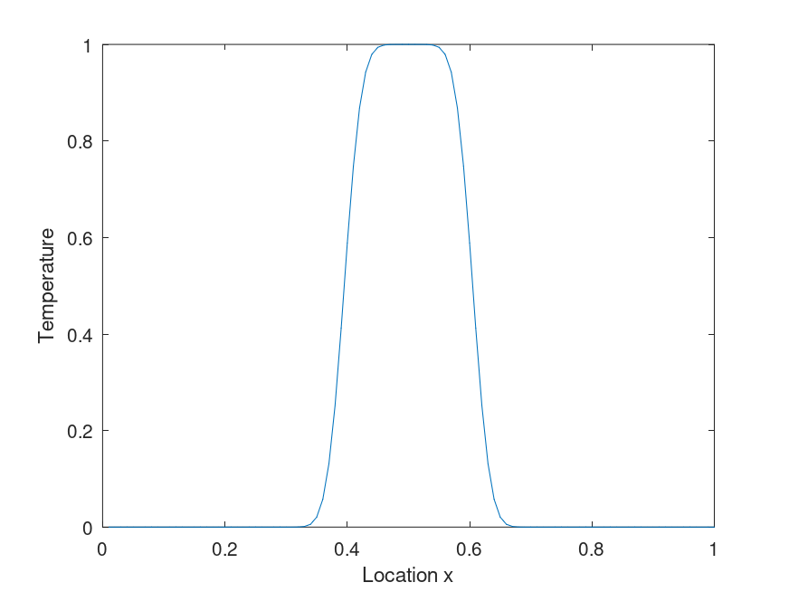

# Engineering and Analysis Algorithms

Found here are a number of algorithms that may (or may not) be used as part of the course. These tend to have applications in analysis which is applied to problems in heat transfer, fluid mechanics, linear algebra and other useful real life problems.

Return to the [main repository documentation](./README.md).

**Table of Contents**

[1 -Conjugate Gradient Solver](#cg)  
[2 -1D FTCS Finite Difference Solver](#1dftcs)  


<a id="cg"></a>
## 1 - Conjugate Gradient Method

The Conjugate Gradient (CG) method is a Krylov subspace based method which is described well in [Wikipedia](https://en.wikipedia.org/wiki/Conjugate_gradient_method). It is an iterative method for solving problems of the form **Ax = B* where:

* A is a square symmetrical matrix (MxM),
* B is a vector (Mx1)

hence x will also be a Mx1 vector.

This method is easily broken down into two main mathematical operations:

* A vector dot product - this can be parallelised using parallel reduction, and
* A matrix-matrix product - this is also parallelisable by sharing work across rows, or by dividing the matrix into a collection of smaller matrices.

### Running the code

This code is provided as a Matlab M file (**CG_Method.m**); it can be run:
* In Matlab, or
* In Octave.

Once you have the workspace pointing to the directory the code is located, you can run:

```matlab
A = [2,3,6; 3,4,5; 6,5,9]
B = [1;2;3]

# Now run CG
[x, RTR_Record] = CG_Method(A, B)
```
### Expected Result

```matlab
x =

   0.4348
   0.3913
  -0.1739

RTR_Record =

 Columns 1 through 7:

   1.4000e+01   6.4202e-01   5.0399e-01
   5.2720e-27   3.2276e-32   2.4327e-32   6.2544e-54

 Columns 8 through 10:

   2.2369e-63   4.5284e-60   2.4616e-81
```

### Application

You could use this to solve any problem where you might need to:
* Compute a steady temperature field (perhaps using Finite Difference), or
* Compute displacement, strain and stress in a solid (Finite Element)

<a id="1dftcs"></a>
## 2 - 1D FTCS Finite Difference Solver for Heat Transfer

Another problem well suited to studies in parallel computing for engineering students, the 1D FTCS method is also well documented in [Wikipedia](https://en.wikipedia.org/wiki/FTCS_scheme). It is an explicit method, meaning the temperatures computed at time step (k+1) are computed based on values of temperature throughout the bar at time (k). It's useful for us because is is generally easily vectorized, which makes it ideal for GPU compute, or using the SIMD registers in a CPU.

### Running the code

Open up Matlab (or Octave), set your workspace to the same location as the file (**FTCS_1D.m**) and run this command in the command window:

```matlab
[x] = FTCS_Method(100, 10)
```

### Expected Result

You should see a graph showing the temperature starting to "diffuse" outwards; with the boundary conditions I've selected here, eventually the 1D bar will reach a steady temperature - I'll leave the computation of this temperature to the students.

