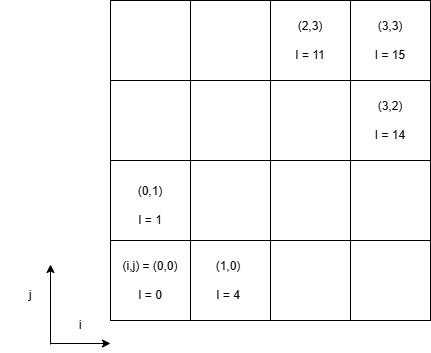

# CSR Storage of Matrices

The Compressed Sparse Row (CSR) format is a method for storing the non-zero elements of a matrix. It is especially useful for large, sparse matrices - for instance, a typical 2D finite element problem might have a stiffness matrix of size 27,000 x 27,000 (around 770 million values total) but may only contain approximately 400,000 non-zero values. This means we can use CSR to hold (and perform computations on) large systems without wasting memory holding a very large number of zeros.

## Example Problem - Steady FTCS 2D Heat Transfer (4x4 grid)

Consider a two dimensional, 4x4 grid. In this case, the total number of cells is 16, meaning that the one dimensional cell index (referred to as I) will range from 0 to 15.




Assuming the spacing is equal, and we are looking for the steady soltuion, the linear equation for cell (i,j) (assuming it is internal) is:

$$T_{(i-1,j)} + T_{(i,j-1)} + T_{(i,j+1)} + T_{(i+1,j)} - 4T_{(i,j)} = 0$$

Note: this will change on the edges of the domain, depending on your boundary conditions.

We can show that this matrix looks like [this](#A_matrix) - but this matrix is mostly 0's. Let's use CSR to store the non-zero elements.

## CSR Overview

While there are some minor differences between implementations, the CSR I'm presenting here is very well suited to parallel computing. We have 3 1D arrays:

* An array called **row_start**, of length (NO_ROWS+1). For the example shown above, since the matrix is 16x16, this array will contain 17 values.
    * The first value is 0
    * The last value is the number of non-zero elements in the matrix.
* An array called **element_value** - this is an array containing the 64 non-zero values in our matrix. For FTCS, these will either be 1 or -4 for the boundary conditions I've selected.
* An array called **element_column** - this is an array containing the column positions of each of the values held in element_value.


## Compiling and Runng the code

To build and run this code, from this directory:

```bash
make
./main.exe
```

## Results

The expected value of the row_start vector is:

```bash
0
3
7
11
14
18
23
28
32
36
41
46
50
53
57
61
64
```

The number of non-zero columns in any row can be found by the difference of two adjascent values of the row_start vector. For instance, row 0 has: row_start[1] - row_start[0] = 3 - 0 = 3 non-zero columns. Row 6 has row_start[7]-row_start[6] = 5 non-zero elements.

The expected value of both the element_column and element_value vectors are:

```bash
0, -4
1, 1
4, 1
0, 1
1, -4
2, 1
5, 1
1, 1
2, -4
3, 1
6, 1
2, 1
3, -4
7, 1
0, 1
4, -4
5, 1
8, 1
1, 1
4, 1
5, -4
6, 1
9, 1
2, 1
5, 1
6, -4
7, 1
10, 1
3, 1
6, 1
7, -4
11, 1
4, 1
8, -4
9, 1
12, 1
5, 1
8, 1
9, -4
10, 1
13, 1
6, 1
9, 1
10, -4
11, 1
14, 1
7, 1
10, 1
11, -4
15, 1
8, 1
12, -4
13, 1
9, 1
12, 1
13, -4
14, 1
10, 1
13, 1
14, -4
15, 1
11, 1
14, 1
15, -4
```

We can use these values to construct the entire matrix A - this is for visual verification purpose only; for computation we would never need to construct the entire sparse matrix.

<a id="A_matrix"></a>
```bash
-4,1,0,0,1,0,0,0,0,0,0,0,0,0,0,0
1,-4,1,0,0,1,0,0,0,0,0,0,0,0,0,0
0,1,-4,1,0,0,1,0,0,0,0,0,0,0,0,0
0,0,1,-4,0,0,0,1,0,0,0,0,0,0,0,0
1,0,0,0,-4,1,0,0,1,0,0,0,0,0,0,0
0,1,0,0,1,-4,1,0,0,1,0,0,0,0,0,0
0,0,1,0,0,1,-4,1,0,0,1,0,0,0,0,0
0,0,0,1,0,0,1,-4,0,0,0,1,0,0,0,0
0,0,0,0,1,0,0,0,-4,1,0,0,1,0,0,0
0,0,0,0,0,1,0,0,1,-4,1,0,0,1,0,0
0,0,0,0,0,0,1,0,0,1,-4,1,0,0,1,0
0,0,0,0,0,0,0,1,0,0,1,-4,0,0,0,1
0,0,0,0,0,0,0,0,1,0,0,0,-4,1,0,0
0,0,0,0,0,0,0,0,0,1,0,0,1,-4,1,0
0,0,0,0,0,0,0,0,0,0,1,0,0,1,-4,1
0,0,0,0,0,0,0,0,0,0,0,1,0,0,1,-4
```
Which is exactly the result we were looking for.