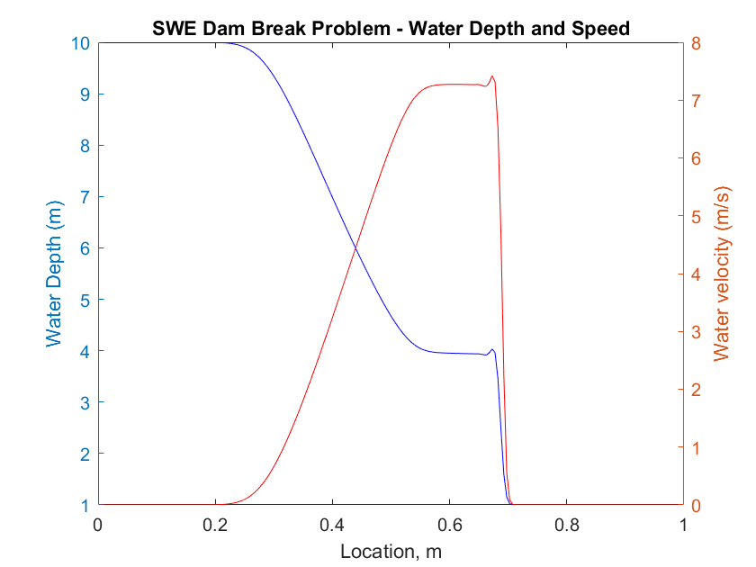

# Shallow Water Equations (1D) Simulation

## Finite Volume Method (FVM) Introduction

The Finite Volume Method (FVM) is a commonly used approach for solving Partial Differential Equations in Engineering, Mathematics and Physics. In any Finite Volume Method, we aim to look at how fluxes of conserved quantities (often labeled as F) are related to the conserved quantities (often labeled as U). Examples of conserved quantities are mass and momentum - and to compute changes in these, we look at the fluxes of mass and momentum across cell surfaces.

You can learn more about Finite Volume Methods [here](https://en.wikipedia.org/wiki/Finite_volume_method). For the puprose of this example, which is 1D and quite simple, we are solving the PDE:

$$
\frac{\partial U}{\partial t} + \frac{\partial F}{\partial x} = 0 
$$

where U is a vector containing conserved quantities, and F is the vector of those conserved quantities.

## Shallow Water Equations

In 1D for constant fluid density and no changes in the fluid bottom height, we can write the shallow water equations as:

$$
\frac{\partial U}{\partial t} + \frac{\partial F}{\partial x} = 0 
$$

with

$$
U = [ \begin{array}{c}
        n \\
        nu 
      \end{array} ]
\,\,\,\,\,\,\,
F = [ \begin{array}{c}
        nu \\
        nu^2 + 0.5gn^2 
      \end{array} ]
$$

where $n$ is the fluid depth and $u$ is the fluid speed. For these equations, the characteristic speed is $a = \sqrt{gn}$.

## Rusanov Fluxes

The Rusanov fluxes are a combination of the central difference fluxes with an added dissipative term and can be written as:

$$
F_{i+1/2} = (1/2)(F_i + F_{i+1}) - (1/2)a_{i+1/2}(U_{i+1} - U{i})
$$

where $i+1/2$ represents the interface seperating cell $i$ and $i+1$, $F_i$ is the vector of fluxes computed using the values of $U$ at cell $i$ and $a$ is the characteristic speed estimated at the interface as:

$$
a_{i+1/2} = max(a_i, a_{i+1})
$$

## Dam Break Expected Results

For the initial conditions described in the MATLAB file shown, the expected result is:

