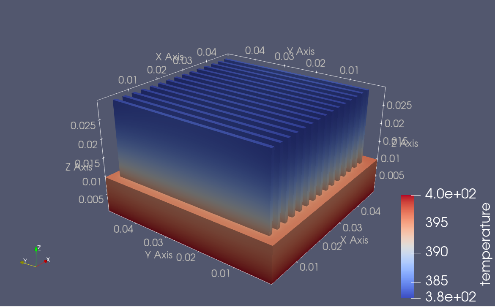

# 3D Heat Transfer Case Study - Convective Heat Sink

This is a simple three dimensional, transient heat transfer simulation of a CPU and a simple heat sink.



This heat sink is based on natural convection; I've (neglectfully) used the analytical solution to natural convection for laminar flow to compute the Grashof number, Nusselt number and finally the heat flux using the vertical flat plate solution.

## Building and Running

To build this code:

```bash
make
```

To run (assuming you have a GPU ready):

```bash
./main.exe
```

The expected output from the command line is:

```bash
CUDA error (malloc d_T) = no error
CUDA error (malloc d_Tnew) = no error
CUDA error (malloc d_Body) = no error
CUDA error (memcpy h_a -> d_a) = no error
CUDA error (memcpy h_a -> d_a) = no error
Running calculation with CFLs = 0.0804236, 0.0804236, 0.223399 for total time = 500
CUDA error (memcpy d_a -> h_b) = no error
```


## Using Paraview

### File Format

Paraview accepts a number of file formats, but the CSV file is easily loaded and transformed into a 3D grid in the event the mesh is structured (i.e. Cartesian).

Your CSV file should be comma delimited, and have a header which outlines the data being read in. In C, this looks like:

```bash
    fprintf(fptr, "x coord, y coord, z coord, body, temperature\n");
```

In this case, we have 3 coordinates, and a single scalar.

For each cell, we print to the CSV file:

```bash
    for (int index = 0; index < N; index++) {
        // This is how we change a 1D index to the x, y and z cell index
		int xcell = (int)(index/(NY*NZ));
		int ycell = (int)((index-xcell*NY*NZ)/NZ);
		int zcell = index - xcell*NY*NZ - ycell*NZ;
        float cx = (xcell+0.5)*DX;
        float cy = (ycell+0.5)*DY;
        float cz = (zcell+0.5)*DZ;
        fprintf(fptr, "%g, %g, %g, %g, %g\n", cx, cy, cz, h_Body[index], h_T[index]);
    }

```

### Loading and Transforming

Follow these steps to render 3D results in paraview.

* Open the CSV file you are loading.
* You'll be prompted to select a reader - select CSV reader, then OK.
* This will open another control panel on the left hand side of Paraview - click "Apply"
* A table will appear on the right if successful; this table can be closed. 
* Right click on the table you've just loaded as it appears in the pipeline browser. Select "Add Filter" -> "Alphabetical" -> "Table to Structured Grid".
* In the new panel, set the number of cells in the X,Y and Z directions in the "Whole Extent" part of the panel.
* Below this, select the x coord, y coord and z coord columns from the data for the X, Y and Z columns respectively. Click Apply.

### Viewing Results

With this data, we can view the solid body.
* Select the structured grid data in the pipeline.
* On the tool bar, select the icon which describes "Extract Cells that satisfy a threshold criterion".
* Select Body (which ranges from 0 to 1) and set the lower and upper thresholds to 0.95 and 1.0 respectively. Click Apply.
* We can colour these cells using another column, if present. In this case, we would use Temperature - this produces the image shown at the top of this README.

#### Cutting the solid body

* Select the cells generated using the threshold  - often called "Threshold1" by default.
* Select the icon in the toolbar the icon for "Clip with an implicit function".
* In the panel that appears, enter the normal in the Plane Parameters to switch the plane direction.
* Select apply.