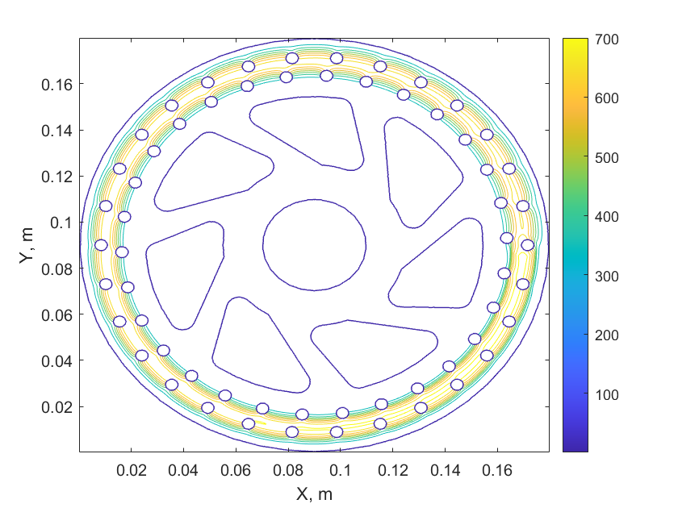

# 2D Heat Transfer Case Study - Disk Brake Heating

This is a simple two dimensional, transient heat transfer simulation of a bicycle disk brake.

When writing this code, I started with the 3D code from the 3D Heat Sink calculation as a starting point.

## Building and Running

To build this code:

```bash
make
```

To run (assuming you have a GPU ready):

```bash
./main.exe
```

The expected output from the command line is:

```bash
CUDA error (malloc d_T) = no error
CUDA error (malloc d_Tnew) = no error
CUDA error (malloc d_Body) = no error
CUDA error (memcpy h_a -> d_a) = no error
CUDA error (memcpy h_a -> d_a) = no error
Running calculation with CFLs = 0.0142094, 0.0142094 for total time = 1.2 with 12000 steps
CUDA error (memcpy d_a -> h_b) = no error
```

The expected temperature distribution looks like this:



The shown temperature is after a simulated time of 1.2 seconds.

