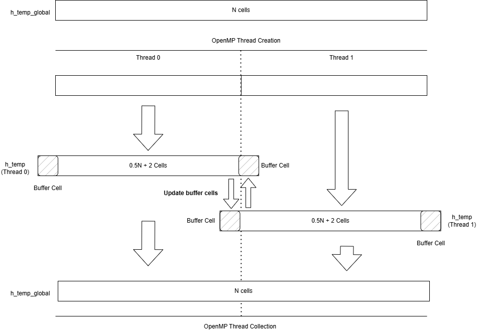

# Multi-GPU 1D heat transfer simulation

This is a simple demonstration of using 2 GPU devices to accelerate a simple transient 1D heat transfer problem.

The main idea behind using multiple GPU devices in this case is to:

* Divide our 1D problem with N cells into two smaller problems with N/2 cells.

* Each OpenMP thread will work with its own GPU - hence, this code requires your local machine have two GPU devices to function properly.

    **NOTE** This code does not check if your machine has multiple devices. Buyer beware.

* Because we need each of these smaller domains to share a boundary, we employ **buffer cells** - additional cells on each thread's domain which hold the value of temperature from the neigbouring domain. This is shown below:



## OpenMP and MPI

Worth mentioning is the early creation of OpenMP threads. One might normally use OpenMP for loop sharing - in this case, OpenMP is used to host two processes which are working together. A perfectly viable alternative to this is MPI, which would permit multiple GPU's connected via a network to work together. This demonstration is restricted to shared memory parallelization.

The only shared memory variables are:
* h_temp_global, and
* h_swap - a small array used as an intermediate storage point for swapping buffer cell values between time steps.

All of the remaining variables are private - created after the OpenMP threads are created:
* h_temp - holding 0.5*N + 2 cells - each thread has its own copy.
* d_temp - the GPU version of h_temp.
* d_temp_new - the new computed temperature over a time step.

These variables have a lifetime of the OpenMP thread. Because we use the thread ID of each OpenMP thread to set the device, the GPU variables are also held on different devices.

**NOTE** To modfify this code to run on a single GPU device (but still use multiple threads), simply comment out this line:

```C
        // Comment this line to run this demonstration on a single device
        GPU_Set_Device(tid);
```

## Building and running

**NOTE** This demonstration was written for WSL users in mind who may have CUDA installed in the /usr/lib/wsl/lib location. Hence it's inclusion in the makefile:

```bash
all: GPU CPU
        g++ -fopenmp -L/usr/lib/wsl/lib -L/usr/local/cuda/lib64 main.o gpu.o -lcuda -lcudart -o main.exe
GPU:
        nvcc -code=sm_80 -arch=compute_80 -lcuda -lcudart  -L/usr/local/cuda/lib64 gpu.cu -c
CPU:
        g++ main.c -fopenmp -c -lcudart
clean:
        rm *.o main.exe
```
If you are running this in a native linux environment, you won't require it.

To make and run this:

```bash
make && ./main.exe
```

You'll see the values printed to the screen - graphing is left to the reader as an exercise.

```bash
-------- Final single result ----------
h_temp_global[0] = 1
h_temp_global[1] = 1
h_temp_global[2] = 0.999999
h_temp_global[3] = 0.999999
h_temp_global[4] = 0.999998
h_temp_global[5] = 0.999996
h_temp_global[6] = 0.999994
h_temp_global[7] = 0.99999
h_temp_global[8] = 0.999985
h_temp_global[9] = 0.999976
h_temp_global[10] = 0.999963
```