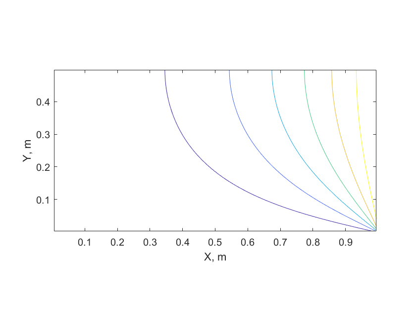

# GPU Parallelization using CUDA

This documentation refers to the source codes used in the folders prefixed with G_, which mainly examine the use of CUDA for acceleration of computation through the use of Nvidia GPU devices.

Return to the [main repository documentation](./README.md).

**Table of Contents / Quick Links**

[G1 - Allocating memory in CUDA](#gpu_memory)  
[G2 - Allocating memory in CUDA](#gpu_memcpy)  
[G3 - Vector x C in CUDA](#gpu_vec_by_c)  
[G4 - Partial Dot Product using Parallel Reduction in CUDA](#gpu_dot_product)  
[G5 - Sequential (Serial) Vector x C in CUDA](#gpu_vec_by_c_serial)  
[G6 - Parallel Compute of Reynolds number vector in CUDA](#gpu_re)  
[G7 - 2D FTCS in CUDA using 2D thread blocks and 2D blocks](#gpu_2dthreads)  

<a id="gpu_memory"></a>
## G1 - Memory Allocation using CUDA

This code simply compares and contrasts setting memory on a GPU device, and setting memory on a host (i.e. CPU). To this end, all variables for use by CPU's are prefixed with "h_"  (host) while variables designed for execution on the GPU are prefixed with "d_" (device).

To build and run - navigate to the directory holding this example and type "make", i.e.:

```bash
cd G_1_Memory/
make && ./main.exe
```

### Expected Output
```bash
CUDA error (malloc d_a) = no error
```

<a id="gpu_memcpy"></a>
## G2 - Moving data between the device and the host

In this code, we move an array of data from the host to the device, and then back
to the host - in a different memory space.

To build and run - navigate to the directory holding this example and type "make", i.e.:

```bash
cd G_2_MemCpy/
make && ./main.exe
```

### Expected Output

A snippet of the output is shown below:

```bash
CUDA error (malloc d_a) = no error
CUDA error (memcpy h_a -> d_a) = no error
CUDA error (memcpy d_a -> h_b) = no error
Value of h_b[0] = 0
Value of h_b[1] = 1
Value of h_b[2] = 2
Value of h_b[3] = 3
Value of h_b[4] = 4
Value of h_b[5] = 5
Value of h_b[6] = 6
Value of h_b[7] = 7
Value of h_b[8] = 8
Value of h_b[9] = 9
Value of h_b[10] = 10
Value of h_b[11] = 11
Value of h_b[12] = 12
```

<a id="gpu_vec_by_c"></a>
## G3 - Multiplication of a vector by a constant in CUDA

The first real computation using CUDA - in this example, we multiply a vector by a constant using the GPU. 

To build and run - navigate to the directory holding this example and type "make", i.e.:

```bash
cd G_3_Vector_Multiply_Constant/
make && ./main.exe
```

### Expected Output

A snippet of the output is shown below:
```bash
CUDA error (malloc d_a) = no error
CUDA error (memcpy h_a -> d_a) = no error
CUDA error (memcpy d_a -> h_b) = no error
Value of h_b[0] = 0
Value of h_b[1] = 0.5
Value of h_b[2] = 1
Value of h_b[3] = 1.5
Value of h_b[4] = 2
Value of h_b[5] = 2.5
Value of h_b[6] = 3
Value of h_b[7] = 3.5
Value of h_b[8] = 4
Value of h_b[9] = 4.5
Value of h_b[10] = 5
Value of h_b[11] = 5.5
Value of h_b[12] = 6
```

<a id="gpu_dot_product"></a>
## G4 - Partial Dot Product on GPU using Parallel Reduction and CUDA

This example demonstrates the use of parallel reduction on GPU for the computation of a dot product. Here we deliberately return a result early so students can understand how parallel reduction works in GPUs; normally we'd finish the dot product on the device.

The following concepts are covered:
* Recycling allocation and memory copying functions for general use,
* Using __syncthreads to sync efforts on the device,
* Using __shared__ memory on the device for faster temporary storage.

To build and run - navigate to the directory holding this example and type "make", i.e.:

```bash
cd G_4_Dot_Product/
make && ./main.exe
```

### Expected Output

A snippet of the output is shown below:

```bash
CUDA error (malloc d_x) = no error
CUDA error (malloc d_y) = no error
CUDA error (malloc d_z) = no error
Serial dot product = 1000
CUDA error (memcpy host -> d_x) = no error
CUDA error (memcpy host -> d_y) = no error
CUDA error (memcpy d_z -> host) = no error
Value of h_z[0] = 256
Value of h_z[1] = 256
Value of h_z[2] = 256
Value of h_z[3] = 232
GPU Dot Product of h_x and h_y = 1000
```

<a id="gpu_vec_by_c_serial"></a>
## G5 - Multiplication of a vector by a constant in CUDA using a single thread

This is a modification of G3 - we take a vector and multiply it by a constant - except, unlike G3,
in this example there is only 1 thread and 1 block performing the computation.

This means that each thread (the only thread!) needs to perform all N computations, if the vector is N long.

To build and run - navigate to the directory holding this example and type "make", i.e.:

```bash
cd G_5_Serial_Compute/
make && ./main.exe
```

### Expected Output

A snippet of the output is shown below:
```bash
CUDA error (malloc d_a) = no error
CUDA error (memcpy h_a -> d_a) = no error
CUDA error (memcpy d_a -> h_b) = no error
Value of h_b[0] = 0
Value of h_b[1] = 0.5
Value of h_b[2] = 1
Value of h_b[3] = 1.5
Value of h_b[4] = 2
Value of h_b[5] = 2.5
Value of h_b[6] = 3
Value of h_b[7] = 3.5
Value of h_b[8] = 4
Value of h_b[9] = 4.5
Value of h_b[10] = 5
Value of h_b[11] = 5.5
Value of h_b[12] = 6
```


<a id="gpu_re"></a>
## G6 - Parallel compute of Reynolds numbers on GPU using CUDA and device functions

This is an extension of G_3 - except this time, we are computing the Reynolds number based on arrays of mass flow rates and cross sectional areas. What makes this example special is its use of a CUDA device function - a function which we call on the GPU from within a kernal currently running within an SM on the device. These look like ordinary C functions, except that are prefixed with __device__.

To build and run - navigate to the directory holding this example and type "make", i.e.:

```bash
cd G_6_Device_Functions/
make && ./main.exe
```

### Expected Output

A snippet of the output is shown below:
```bash
CUDA error (malloc d_mass_flow_rate) = no error
CUDA error (malloc d_area) = no error
CUDA error (malloc d_Re) = no error
CUDA error (memcpy mass flow rates) = no error
CUDA error (memcpy areas) = no error
CUDA error (memcpy reynolds numbers) = no error
Value of h_Re[0] = 62341.4
Value of h_Re[1] = 62652.4
Value of h_Re[2] = 62961.7
Value of h_Re[3] = 63269.6
Value of h_Re[4] = 63576
Value of h_Re[5] = 63880.9
Value of h_Re[6] = 64184.4
```

<a id="gpu_2dthreads"></a>
## G7 - Parallel compute of 2D Heat Transfer using FTCS with 2D thread blocks and 2D grid blocks

This is a 2D unsteady heat transfer solution using the FTCS method (covered in the algorithms section) where one boundary is a symmetry boundary while three other boundaries are fixed temperature.

The really unique contribution made in this code is the use of:

* 2D thread blocks - each block is made up of 256 threads in a 16x16 arrangement. This means we have 16 threads in the x direction, and 16 threads in the y direction.
* 2D blocks in the grid - the grid is made up of an arrangement of thread blocks, layed out in 2D. Since our solver uses a 100 x 100 grid, we need 7 blocks in the x and y direction.

The x and y cell - computed in the kernel - is computed directly from the block ID and thread ID in each direction instead of computing it from the 1D index we previously used in class. This is wasteful, however - there are better ways we can compute these more efficiency to avoid having so many idle threads in a kernel.

### Building and Running

To build and run - navigate to the directory holding this example and type "make", i.e.:

```bash
cd G_7_2D_Threads/
make && ./main.exe
```

### Expected Output

You should see this on succesful execution:

```bash
CUDA error (malloc d_T) = no error
CUDA error (malloc d_Tnew) = no error
CUDA error (memcpy h_T -> d_T) = no error
CUDA error (memcpy d_T -> h_T) = no error
```

A results file (results.txt) should be present, with the computed results. These can be drawn in a contour, which should look like this:

